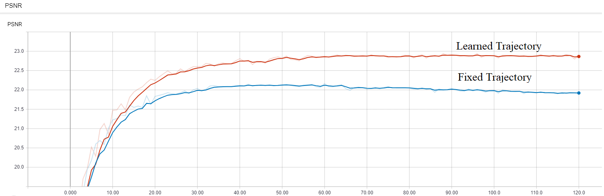
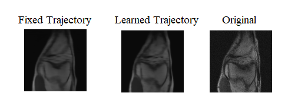
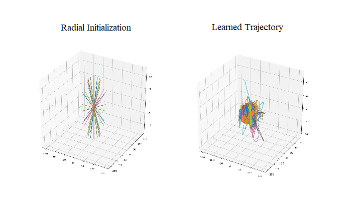

# 3D PILOT: Physics-Informed Learned Optimal 3D Trajectories for Accelerated MRI

Jonathan Alush-Aben and Linor Ackerman

## Introduction

Magnetic Resonance Imaging (MRI) has long been considered to be among "the gold standards" of diagnostic medical imaging.
The long acquisition times, however, render MRI prone to motion artifacts, let alone their adverse contribution to the relative high costs of MRI examination.
Over the last few decades, multiple studies have focused on the development of both physical 
and post-processing methods for accelerated acquisition of MRI scans. These two approaches, however, have so far been addressed separately.

In this work, we propose a novel approach to the learning of optimal schemes for conjoint acquisition and reconstruction of MRI scans,
with the optimization carried out simultaneously with respect to the time-efficiency of data acquisition and the quality of resulting reconstructions.

We generalize an earlier work done at our faculty for learning a sampling scheme from 2 dimensions to 3 dimensions. 
Although MRI is 3D by nature, we are the first to implement a deep learning approach to finding a 3D sampling scheme.

## Results
We performed experiments using 3D MRI sampling k-space trajectories that are shown to be effective in recent research. 
Learning a trajectory based on an initial initialization, yields better results than using that same trajectory without changes.
This is measured in terms of reconstruction accuracy (PSNR).
Note that the learned trajectory is physically feasible; due to the loss function that takes into account the physical constraints of the MRI scanner.

Attached is a preliminary result that demostrates an improvment of 1db when learning a trajectory.

This is the an example of the reconstruction output:

This example demonstates a decimation rate of 4 with 49 shots.

We also show an example of a learned trajectory and it's initialization - radial in this case.

## Dependencies

To install other requirements through `$ pip install -r requirements.txt`.

## Usage

First you should download the singelcoil dataset from [fastMRI](https://fastmri.med.nyu.edu/) and split the training + validation sets to training + validation + test set.
Update the datasets location in `common/arg.py`.
We provide a utility to run an experiment - in `exputil.py`, call the function with the desired parameters.

## References
We used [PILOT: Physics-Informed Learned Optimal Trajectories for Accelerated MRI](https://github.com/tomer196/PILOT) as base to our implementation.
